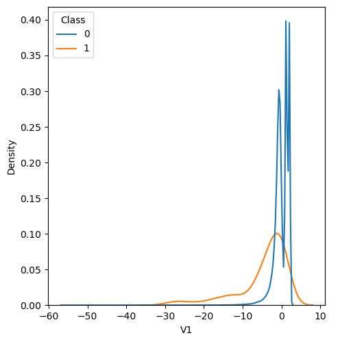
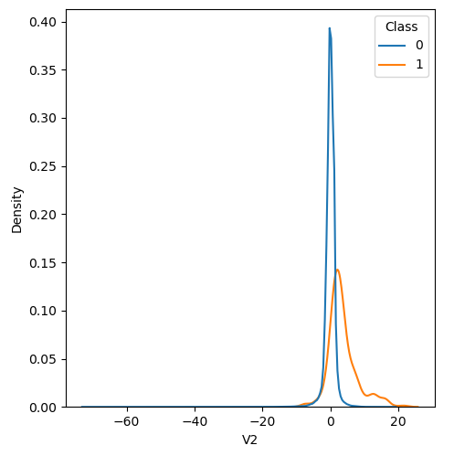
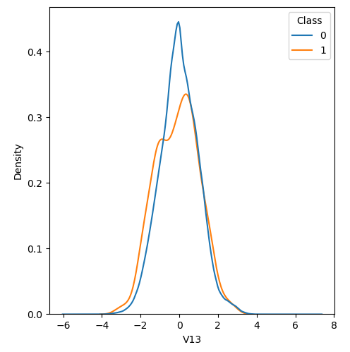
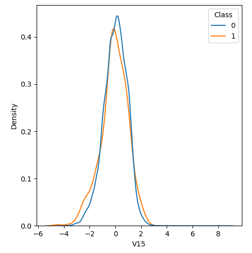
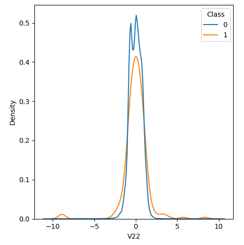
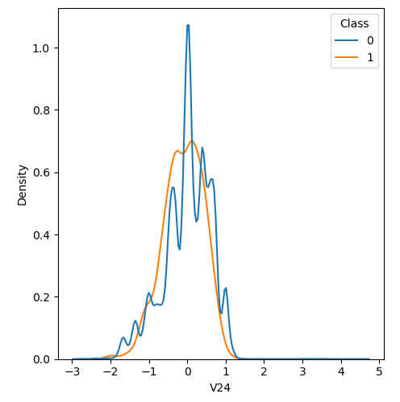
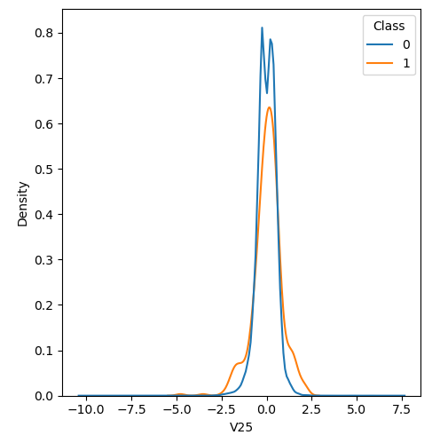
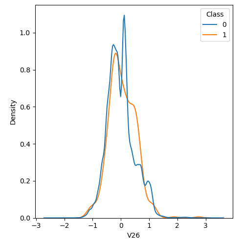
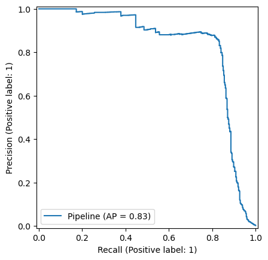
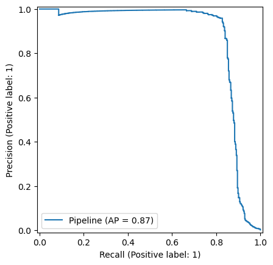

# Introduction
With the growth in spread of digital payment technology, cases of digital fraud are also on the rise. It is imperative that systems will be evolved to tackle the problem of fraudulent transactions so that customers are not charged for items they did not purchase. This project takes <a href="https://www.kaggle.com/datasets/mlg-ulb/creditcardfraud"> transaction data of credit cards</a> and tries to evolve a machine learning program that can identify fraudulent transactions. Informally speaking, a program is needed that will find transactions which are fraudulent, depending on various features associated with a given transaction, before the transaction has completed.

There dataset consists of 285K records of transactions made by credit cards in September 2013 by European cardholders. Fraudulent transactions constitute 0.17% of total transactions by volume and 0.24% of total transaction by value. Although the volume and value in percentage terms seems small due to the large scale of operation, in absolute terms the losses are immense. If the predictions from the model reduce the number of fraudulent transactions, it will result in huge savings in the long run.

# Methodology

## Libraries used

1. For handling data : Pandas, Numpy  
2. For visualization : Matplotlib, Seaborn  
3. For machine learning : Scikit-learn, imbalanced-learn, SciPy

## Defining the problem

In order to give our problem a formal footing, we can look at the following definition of machine learning as given by Tom Mitchell :   
> A computer program is said to learn from experience E with respect to some class of tasks T and performance measure P, if its performance at tasks in T, as measured by P, improves with experience E. 

Conforming our problem to this definition, we can define our unknowns as :

- Task (T) : To classify a transaction that hasn't yet been fully processed to be fraudulent or non-fraudulent  
- Experience (E) : A collection of transactions where some are fraudulent and some are not  
- Performance (P) : The number of transactions which are non fraudulent

### Similar problems

Due to the unique nature of this problem, where instances of interest occur with a rare frequency, this problem is similar to anomaly detection and outlier detection.

### Current solutions

The current solution to finding fraudulent transactions are enumerated as follows:  
- Rule based systems for e.g. if transaction exceeds a spending limit or if IP address differs from shipping address  
- Multi factor authentication  
- One time passwords  
- 3D Secure (3DS)  
- Address Verification Service (AVS)  
- Card Verification Value (CVV)  
- Biometric verification  
- Data enrichment techniques which augment transaction data with external information, live device data and geo-location.

## Exploring the data

The dataset contains ~285K transactions made by European cardholders over a two day period in September 2013. The numerical input variables (totaling 28 in number) are arrived at by PCA transformation to maintain confidentiality. The non-transformed variables are  `Time` (seconds elapsed since first transaction) and `Amount` (amount of transaction). The variable `Class` is the target and indicates whether the transaction was fraudulent (1) or non-fraudulent (0).

There are no missing values. Non-fraudulent transactions consist of an overwhelming majority of 99.83% of records, whereas fraudulent transactions consist of 0.17%. Over the period of data collection, from the total transaction value of &euro; 25,162,590, &euro; 60,128 was involved in fraudulent transactions, which amounts to 0.24% of total transaction value. Thus, the distribution of `Class` is imbalanced.

### Assumptions about the data

1. The data collected over the two day period is representative.  
2. The PCA transformed numerical inputs are collected before the transaction is completed.   
3. The time at which transaction has occurred does not correlate to `Class`

### Plots

In order to visualize the distribution of various features, and their distribution when they are grouped by `Class`, the following plots are generated. They give a visual intuition regarding the discriminating power of various features. If the feature has the same distribution across the two groups of fraudulent and non-fraudulent transactions then that feature has no discriminating power. From a visual inspection of below graphs, V6, V13, V15, V22, V24, V25, V26 seem to have very similar density distribution across fraudulent and non-fraudulent cases.

|  |  |  |
|-----------------|-----------------|-----------------|
|  |  |  |
|  |  |  |

[Click here for all plots](img/univariate.png)

### Mann-Whitney U test

Mann Whitney U is a non-parametric test to check whether two populations are identically distributed. We cannot use t-test here because its assumption that the two distributions should be normally distributed is not satisfied. The null hypothesis of Mann-Whitney U test is that the distribution of two populations are identical. On the basis of this test, a few features (V13,V15,V22) are barred from further consideration to reduce complexity of the model.

## Modelling

### Evaluation metric

We need high recall in this situation in order to detect all true fraudulent transactions. However, due to precision-recall tradeoff, a high recall will adversely impact precision. This would translate to poor user experience as many genuine transactions would be classified as fraudulent. So we need an evaluation metric that takes into consideration both precision and recall and that which focuses more on positive (fraudulent) class. 

F1 score and PR AUC (Precision-Recall Area Under Curve) are two such metrics. F1 will favour precision and recall having similar values, but there is no such consideration required in this scenario. We are vying for a higher recall. Instead of F1 score, we can use F2 score which will give more importance to recall over precision. PR AUC will be a summary metric that will take into account all thresholds and resulting precision and recall. Hence, we choose two evaluation metrics:  Average Precision (discretized version of PR AUC) and F2 score.

### Test harness

The dataset is split in an 80:20 ratio where 80% of data will be used for training, and 20% will be kept aside for estimating generalization error at a later stage. Validation error will be calculated by performing k-fold cross validation. 

### Balancing

The dataset is imbalanced with respect to the target variable i.e. `Class` hence we employ rebalancing techniques. Over-sampling of positive class (fraudulent transactions) is done through SMOTE (Synthetic Minority Oversampling Technique) while under sampling of negative class is done through random under sampling. This provides a more balanced dataset and improves the performance of the model.

### Spot testing various models

A variety of algorithms are chosen to spot check with their default configurations. The algorithms range from simple models (Logistics, Linear Discriminant Analysis), to tree based (Decision tree, Random Forest, Gradient Boosted Trees, AdaBoost), and also Support Vector Machines, K-Nearest Neighbors, and Multi Layer Perceptron. Spot check is performed with a smaller, resampled subset of training data in order to improve fitting time. On the basis of this spot check, it is ascertained that the best performing models are tree based ensemble methods (Histogram Gradient Boosting and Random Forest). Histogram Gradient Boosting provides good performance with low train and inference times but both Histogram based Gradient Boosting and Random Forests are overfitting. These are taken up for further hyperparameter tuning.

# Hyperparameter tuning

For tuning the models, the size of the training dataset is reduced to 50% through resampling to reduce fitting time. The general methodology used is to seek an improvement in validation score while also keeping training score in check. The scoring function used is 'average precision'. Cross validation is performed in order to estimate variance in validation and training score. This will ensure that the generalization error is low.  

### Histogram Gradient Boosting

1. `max_bins=50` gives comparable results to higher values of `max_bin`. However, the train score is high so the model is overfitting.  
      
    | Params | mean_test_score | std_test_score | mean_train_score | std_test_score |  
    | --- | --- | --- | --- | --- |  
    | {'hgb__max_bins': 50} | 0.860728 | 0.049480 | 0.987708 | 0.009457 |  
    | {'hgb__max_bins': 200} | 0.858225 | 0.053159 | 0.988027 | 0.010460 |  
    | {'hgb__max_bins': 255} | 0.854109 | 0.054755 | 0.979819 | 0.032183 |  

2. When `max_depth=2` and `max_bins=50` , mean_test_score remains almost the same, but mean_train_score reduces drastically. Setting a low value of `max_depth` regularizes the model.  
      
    | Params | mean_test_score | std_test_score | mean_train_score | std_test_score |  
    | --- | --- | --- | --- | --- |  
    | {'hgb__max_bins': 50, 'hgb__max_depth': 8} | 0.860260 | 0.051656 | 0.987766 | 0.009068 |  
    | {'hgb__max_bins': 50, 'hgb__max_depth': 2} | 0.845519 | 0.048916 | 0.890494 | 0.007762 |  

3. Changing `learning_rate` does not affect the results and optimum learning rate is near the default learning rate of 0.1  
      
    | Params | mean_test_score | std_test_score | mean_train_score | std_test_score |  
    | --- | --- | --- | --- | --- |  
    | {'hgb__learning_rate': 0.1, 'hgb__max_bins': 100, 'hgb__max_depth': 4} | 0.854492 | 0.052946 | 0.973363 | 0.017663 |  
    | {'hgb__learning_rate': 0.2, 'hgb__max_bins': 50, 'hgb__max_depth': 2} | 0.837929 | 0.041954 | 0.926814 | 0.007448 |  
    | {'hgb__learning_rate': 0.1, 'hgb__max_bins': 100, 'hgb__max_depth': 2} | 0.834128 | 0.056762 | 0.893284 | 0.009976 |  

4. Another regularization parameter can be `max_features` . `max_features = 0.4` increases the mean_test_score while also reducing mean_train_score.  
      
    | Params | mean_test_score | std_test_score | mean_train_score | std_test_score |  
    | --- | --- | --- | --- | --- |  
    | {'hgb__learning_rate': 0.1, 'hgb__max_bins': 100, 'hgb__max_depth': 4, 'hgb__max_features': 0.6} | 0.858904 | 0.054259 | 0.980155 | 0.010521 |  
    | {'hgb__learning_rate': 0.1, 'hgb__max_bins': 100, 'hgb__max_depth': 3, 'hgb__max_features': 0.4} | 0.851308 | 0.053814 | 0.946933 | 0.008449 |  
    | {'hgb__learning_rate': 0.1, 'hgb__max_bins': 50, 'hgb__max_depth': 2, 'hgb__max_features': 0.4} | 0.839217 | 0.061345 | 0.866621 | 0.031578 |  

5. `min_samples_leaf=3000` along with `max_bins=50, max_depth=4, max_features=0.5` produce almost the same results. Using `min_samples_leaf` in conjunction with other parameters does not provide any benefit either with respect to increase in mean_test_score or reduction in mean_train_score.  
      
    | Params | mean_test_score | std_test_score | mean_train_score | std_test_score |  
    | --- | --- | --- | --- | --- |  
    | {'hgb__learning_rate': 0.2, 'hgb__max_bins': 50, 'hgb__max_depth': 4, 'hgb__max_features': 0.5, 'hgb__min_samples_leaf': 3000} | 0.850635 | 0.045820 | 0.953815 | 0.020566 |  
    | {'hgb__learning_rate': 0.1, 'hgb__max_bins': 50, 'hgb__max_depth': 4, 'hgb__max_features': 0.5, 'hgb__min_samples_leaf': 3000} | 0.829798 | 0.045730 | 0.889496 | 0.035958 |  

6. `l2_regularization` does not provide any major improvement to the model. Hence, not using this also.   
      
    | Params | mean_test_score | std_test_score | mean_train_score | std_test_score |  
    | --- | --- | --- | --- | --- |  
    | {'hgb__l2_regularization': 0, 'hgb__learning_rate': 0.1, 'hgb__max_bins': 50, 'hgb__max_depth': 4, 'hgb__max_features': 0.5} | 0.854260 | 0.050694 | 0.979205 | 0.007295 |  
    | {'hgb__l2_regularization': 0, 'hgb__learning_rate': 0.1, 'hgb__max_bins': 50, 'hgb__max_depth': 3, 'hgb__max_features': 0.4} | 0.851472 | 0.061326 | 0.928200 | 0.036915 |  
    | {'hgb__l2_regularization': 0, 'hgb__learning_rate': 0.1, 'hgb__max_bins': 50, 'hgb__max_depth': 2, 'hgb__max_features': 0.4} | 0.833171 | 0.049059 | 0.868262 | 0.015291 |  

7. Increasing `max_iter` provides minimal improvement to the model. Having a high value of `max_iter` leads to overfitting.  
      
    | Params | mean_test_score | std_test_score | mean_train_score | std_test_score |  
    | --- | --- | --- | --- | --- |  
    | {'hgb__learning_rate': 0.1, 'hgb__max_bins': 50, 'hgb__max_depth': 4, 'hgb__max_features': 0.6, 'hgb__max_iter': 1000} | 0.861113 | 0.050726 | 0.982396 | 0.031535 |  
    | {'hgb__learning_rate': 0.1, 'hgb__max_bins': 50, 'hgb__max_depth': 2, 'hgb__max_features': 0.6, 'hgb__max_iter': 500} | 0.845474 | 0.063645 | 0.919762 | 0.054989 |  
    | {'hgb__learning_rate': 0.1, 'hgb__max_bins': 50, 'hgb__max_depth': 2, 'hgb__max_features': 0.4, 'hgb__max_iter': 100} | 0.833132 | 0.059743 | 0.876368 | 0.012102 |  

8. Changing `sampling_strategy` also provides minimal improvement.  
      
    | Params | mean_test_score | std_test_score | mean_train_score | std_test_score |  
    | --- | --- | --- | --- | --- |  
    | {'hgb__learning_rate': 0.2, 'hgb__max_bins': 50, 'hgb__max_depth': 3, 'hgb__max_features': 0.6, 'rus__sampling_strategy': 0.05, 'smote__sampling_strategy': 0.025} | 0.856398 | 0.052151 | 0.975792 | 0.005290 |  
    | {'hgb__learning_rate': 0.2, 'hgb__max_bins': 50, 'hgb__max_depth': 2, 'hgb__max_features': 0.5, 'rus__sampling_strategy': 0.05, 'smote__sampling_strategy': 0.025} | 0.838235 | 0.048555 | 0.910981 | 0.014737 |

The final set of hyperparameters that provide a good fit are : 

`max_bins = 50`|  
`max_depth = 2`|  
`learning_rate = 0.1`|  
`max_features = 0.4`|  
`smote_sampling_strategy =0.025`|  
`randomundersampler_sampling_strategy=0.05`

The associated Precision-Recall curve is shown below.

### Random Forest

1. Optimizing for `max_depth`, we get the following results. As observed, `max_depth` acts as a regularisation parameter, with lower value of `max_depth` leading to lower mean_train_score.  
      
    | Params | mean_test_score | std_test_score | mean_train_score | std_test_score |  
    | --- | --- | --- | --- | --- |  
    | {'rf__max_depth': 10} | 0.837905 | 0.051500 | 0.930738 | 0.009532 |  
    | {'rf__max_depth': 6} | 0.826149 | 0.043798 | 0.882363 | 0.007530 |  

2. Upon optimizing `max_features` along with `max_depth`, the value around 0.4 seems most promising.  
      
    | Params | mean_test_score | std_test_score | mean_train_score | std_test_score |  
    | --- | --- | --- | --- | --- |  
    | {'rf__max_depth': 8, 'rf__max_features': 0.4} | 0.843307 | 0.053148 | 0.907086 | 0.008095 |  
    | {'rf__max_depth': 7, 'rf__max_features': 0.4} | 0.830395 | 0.045150 | 0.888562 | 0.012894 |  
    | {'rf__max_depth': 6, 'rf__max_features': 'sqrt'} | 0.829707 | 0.041479 | 0.882185 | 0.013430 |  

3. Having `bootstrap = True` and `max_samples = 0.7` helps in reducing mean_train_score.  
      
    | Params | mean_test_score | std_test_score | mean_train_score | std_test_score |  
    | --- | --- | --- | --- | --- |  
    | {'rf__bootstrap': False, 'rf__max_depth': 6, 'rf__max_features': 0.3} | 0.842930 | 0.049107 | 0.881239 | 0.011179 |  
    | {'rf__bootstrap': True, 'rf__max_depth': 5, 'rf__max_features': 0.4, 'rf__max_samples': 0.7} | 0.833823 | 0.057091 | 0.867012 | 0.008694 |  

4. Setting `max_leaf_nodes = 100` provides more regularization and mean_train_score reduce even further.  
      
    | Params | mean_test_score | std_test_score | mean_train_score | std_test_score |  
    | --- | --- | --- | --- | --- |  
    | {'rf__bootstrap': True, 'rf__max_depth': 6, 'rf__max_features': 0.5, 'rf__max_leaf_nodes': 1000, 'rf__max_samples': 0.6} | 0.838597 | 0.057041 | 0.879224 | 0.012604 |  
    | {'rf__bootstrap': True, 'rf__max_depth': 4, 'rf__max_features': 0.3, 'rf__max_leaf_nodes': 100, 'rf__max_samples': 0.6} | 0.827642 | 0.053020 | 0.844267 | 0.013082 |

5. The `criterion` of ‘entropy’ or ‘log loss’ gives the best results.

    | Params | mean_test_score | std_test_score | mean_train_score | std_test_score |  
    | --- | --- | --- | --- | --- |  
    | {'rf__bootstrap': True, 'rf__criterion': 'log_loss', 'rf__max_depth': 5, 'rf__max_features': 0.5, 'rf__max_leaf_nodes': 100, 'rf__max_samples': 0.4} | 0.845795 | 0.046057 | 0.883876 | 0.011191 |  
    | {'rf__bootstrap': True, 'rf__criterion': 'entropy', 'rf__max_depth': 6, 'rf__max_features': 0.4, 'rf__max_leaf_nodes': 100, 'rf__max_samples': 0.5} | 0.845477 | 0.036414 | 0.891090 | 0.008494 |  
      
6. Increasing the number of estimators from the default 100 provides minimal improvement but increases train time drastically, hence default `n_estimators = 100` is appropriate.  
      
    | Params | mean_test_score | std_test_score | mean_train_score | std_test_score |  
    | --- | --- | --- | --- | --- |  
    | {'rf__bootstrap': True, 'rf__criterion': 'entropy', 'rf__max_depth': 7, 'rf__max_features': 0.5, 'rf__max_leaf_nodes': 150, 'rf__max_samples': 0.6, 'rf__n_estimators': 300} | 0.858067 | 0.040889 | 0.943415 | 0.004836 |  
    | {'rf__bootstrap': True, 'rf__criterion': 'entropy', 'rf__max_depth': 6, 'rf__max_features': 0.5, 'rf__max_leaf_nodes': 50, 'rf__max_samples': 0.5, 'rf__n_estimators': 100} | 0.855221 | 0.044152 | 0.914726 | 0.006612 |  
    | {'rf__bootstrap': True, 'rf__criterion': 'entropy', 'rf__max_depth': 5, 'rf__max_features': 0.5, 'rf__max_leaf_nodes': 100, 'rf__max_samples': 0.4, 'rf__n_estimators': 300} | 0.851057 | 0.046665 | 0.892381 | 0.009649 |  
    | {'rf__bootstrap': True, 'rf__criterion': 'entropy', 'rf__max_depth': 5, 'rf__max_features': 0.5, 'rf__max_leaf_nodes': 100, 'rf__max_samples': 0.5, 'rf__n_estimators': 100} | 0.849956 | 0.047809 | 0.890280 | 0.009652 |

7. The original `sampling_strategy` provides adequate results.    

    | Params | mean_test_score | std_test_score | mean_train_score | std_test_score |  
    | --- | --- | --- | --- | --- |  
    | {'rf__bootstrap': True, 'rf__criterion': 'entropy', 'rf__max_depth': 7, 'rf__max_features': 0.6, 'rf__max_leaf_nodes': 100, 'rf__max_samples': 0.5, 'rf__n_estimators': 100, 'rus__sampling_strategy': 0.02, 'smote__sampling_strategy': 0.01} | 0.861197 | 0.042957 | 0.940184 | 0.006208 |  
    | {'rf__bootstrap': True, 'rf__criterion': 'entropy', 'rf__max_depth': 5, 'rf__max_features': 0.5, 'rf__max_leaf_nodes': 100, 'rf__max_samples': 0.5, 'rf__n_estimators': 100, 'rus__sampling_strategy': 0.02, 'smote__sampling_strategy': 0.01} | 0.852273 | 0.045264 | 0.892749 | 0.009282 |

The optimum hyperparameter combination is as follows : 

`n_estimators = 100`|  
`max_depth = 5`|  
`criterion = entropy`|  
`boostrap = True`|  
`max_samples = 0.5`|   
`max_features = 0.5`|  
`max_leaf_nodes = 100`|  
`smote_sampling_strategy = 0.01`|  
`randomundersampler_sampling_strategy=0.02`

The associated Precision-Recall curve is shown below.

# Results

Finally, the selected models with their tuned hyperparameter combination are evaluated on the test set, which was set aside before the beginning of this exercise. 

The confusion matrix for Histogram Based Gradient Boosting Classifier on test data (left) and train data (right) is shown below.  

  
  

The following observations are made : 

- Out of 98 instances of positive class (fraudulent transactions), 83 are correctly labelled by this model. Thus, 84.69% of fraudulent transactions are correctly identified by the model in unseen data. This is not very far removed from its performance over training data (shown on right), where 85.28% of fraudulent transactions are correctly identified.  
- The identification of fraudulent transactions led to saving 70.46% of the value of transactions involved in fraudulent transactions which amounted to &euro; 8593.  
- The precision on test data is 71.55% while on train data is 72.72%. 

Similarly, the confusion matrix for Random Forest Classifier is shown below with test data (left) and train data (right).   

  
  

The following observations are made : 

- Out of the total 98 fraudulent transactions, 79 are correctly labelled, thus identifying 80.61% of fraudulent transactions. The performance of this model over training data is higher at 84.52%.  
- The identification of fraudulent transactions led to saving of 67.74% of the value of transactions involved in fraudulent transactions which amounted to &euro; 8261.  
- The precision on test data is 77.45% while on train data is 85.17%

Thus, Histogram Gradient Boosting Classifier provides comparable performance to Random Forest Classifier, but owing to its significantly lower fitting time, it is chosen as the final model.

# Conclusion

With this exercise, a program is developed using machine learning which provides good performance in detecting fraudulent transactions. It is able to detect more than 80% of fraudulent transactions, leading to significant savings. If the following metric is extended to value that was lost to fraudulent transactions over the two day period, this can potentially lead to saving $$0.8 \times 60,128 \approx  \text{€} 48,100$$.

At the same time, the precision of the model is above 70%, hence a majority of transactions flagged as fraudulent will actually be fraudulent, thus not causing major inconvenience to genuine transactions.

# Future work

The current model does not focus on the monetary value of transactions. If weights are attached corresponding to the monetary value involved in a transaction then the model may perform better. This could be a possible area of work in the future.  
